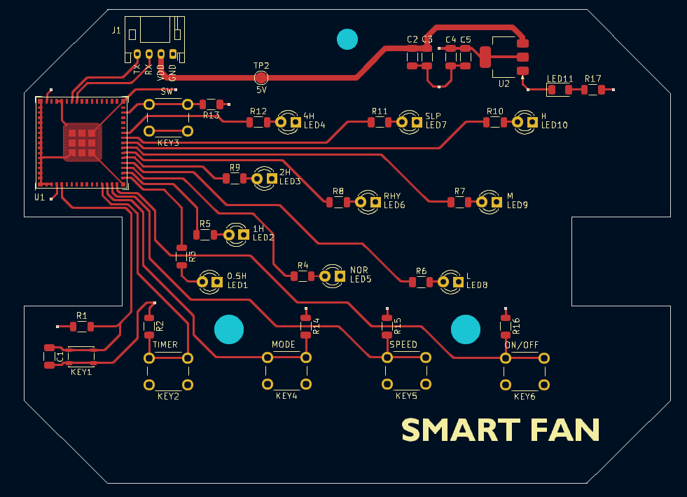
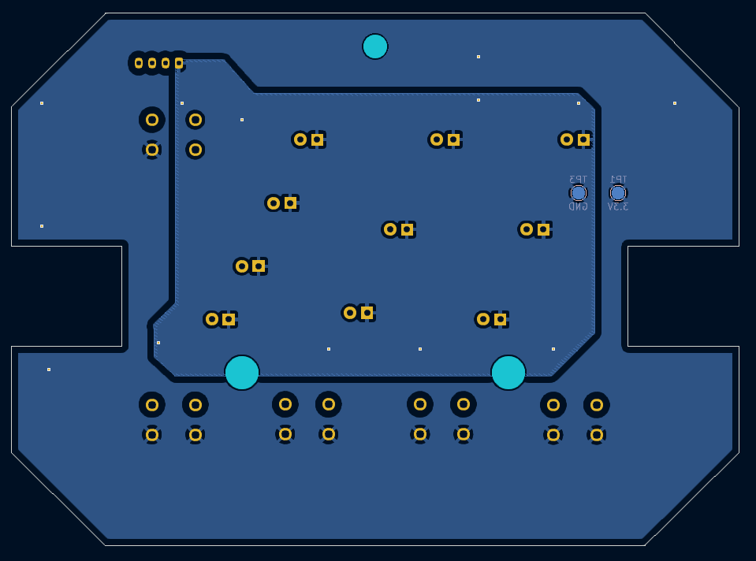
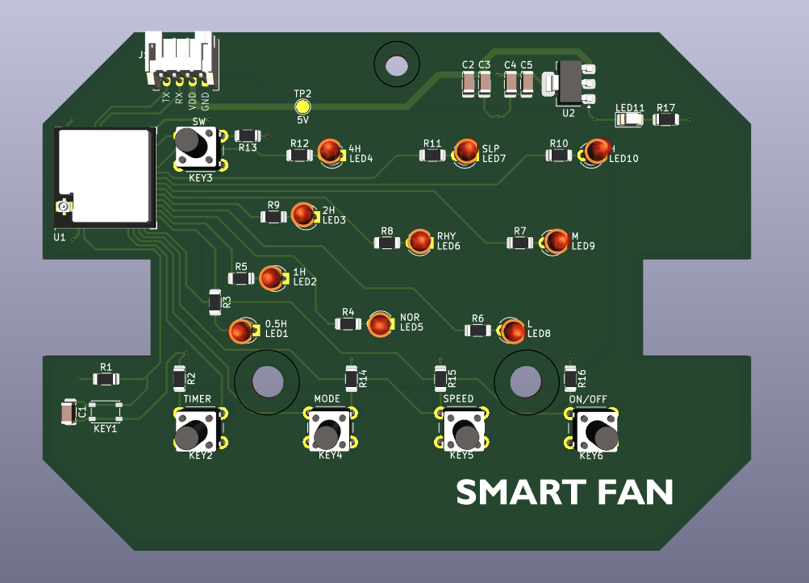
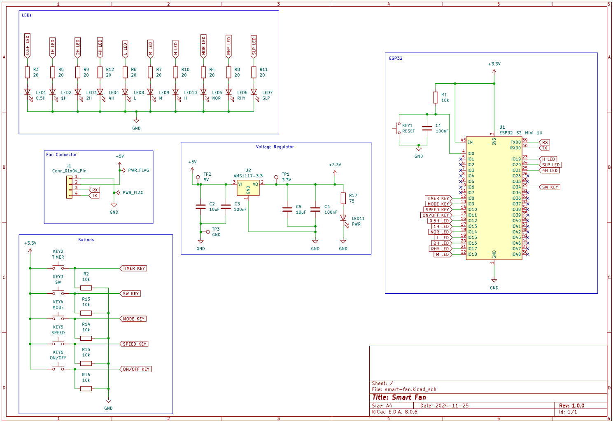

# Hardware Notes

## Safety

This project interfaces with a mains-powered appliance. Only work on disconnected hardware, and follow appropriate electrical safety practices.

## Original Fan Boards

The stock fan electronics use two PCBs:
- Main board for power/motor control
- Front-panel board for buttons, LEDs, and IR receiver

Inter-board connector signals:
- TX
- RX
- VDD (about 5V)
- GND

## Reverse-Engineering Findings

- The main board accepts UART control commands at 334 baud.
- State appears to be continuously transmitted by the stock controller.
- Full bidirectional, high-level synchronization with the original display board was not confirmed.

## Custom Board Direction

The custom board replaces front-panel logic while preserving user experience:
- Physical buttons for on/off, speed, timer, and mode positions
- LED indicators for speed and modes
- IR receiver input
- ESP32 integration for Home Assistant control

## Current Assets in Repo

- KiCad source files in `hardware/`
- Manufacturing Gerbers in `hardware/Gerber/`
- Production files (BOM, designators, positions, netlist) in `hardware/production/`
- Visual references in this `docs/` folder

## Design Intent

The custom board aims to preserve the original user experience while moving logic to ESPHome:
- Keep physical buttons and status LEDs
- Keep IR receiver support
- Keep compatibility with original fan UART control path

## Visual References

