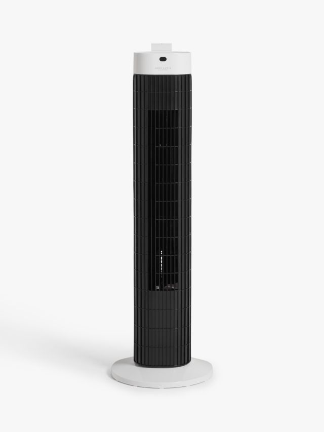
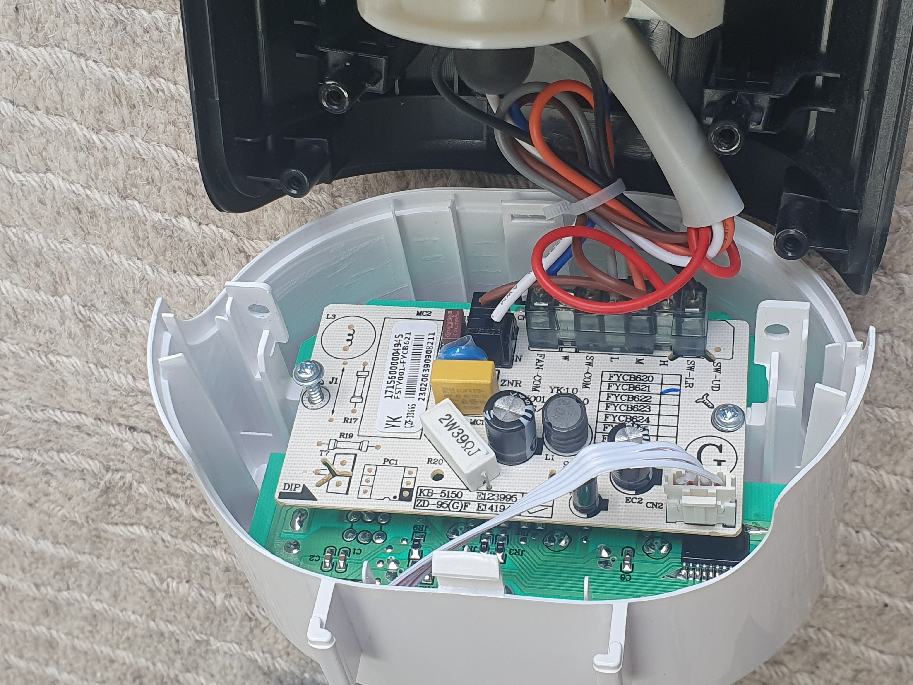
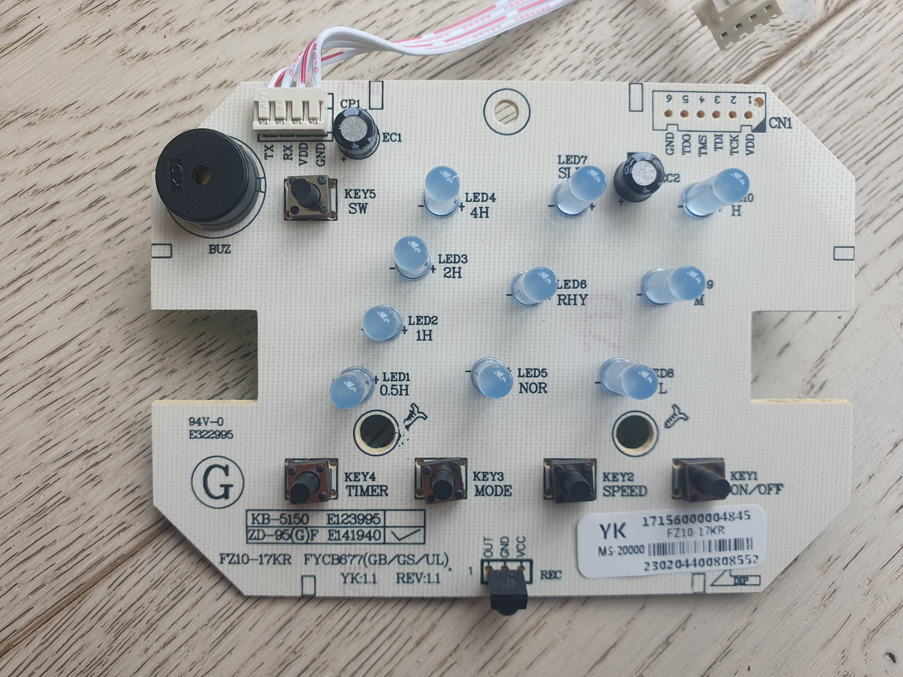
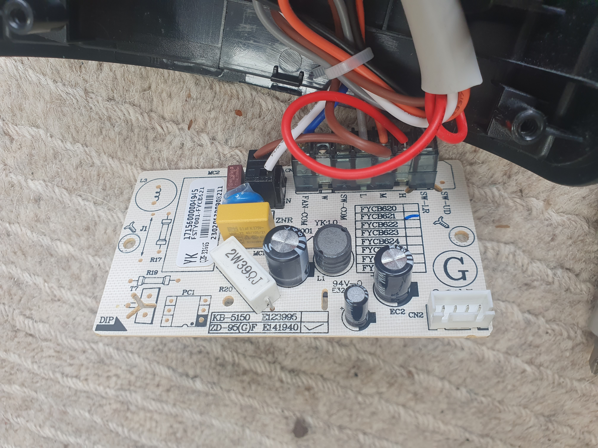

# Smart Fan Project Story

## Goal

Control a John Lewis FZ10 17KR fan from Home Assistant using ESPHome and a custom ESP32-based front panel board.

## Background

The fan has two internal boards:
- Main control board connected to motor and power path
- Display/input board connected to LEDs, buttons, and IR receiver

The boards communicate over a 4-wire link:
- TX
- RX
- VDD (about 5V)
- GND

### Teardown Photos

*Original fan installed*

*Top control/display board with buttons, LEDs, and IR receiver*

*Bottom side showing power path and connector*

## Reverse Engineering

The original control path was inspected by probing RX/TX with an Arduino.

Observed behavior:
- TX line from the fan side appears mostly high
- RX line carries a repeating 5-byte message representing current fan state
- Effective baud rate is 334

This gave enough information to emulate commands from ESPHome.

## ESPHome Integration

Implemented in firmware:
- Fan on/off
- 3 speeds (low, medium, high)
- Oscillation toggle
- Home Assistant API + OTA updates

Current status:
- Core fan functions are stable from Home Assistant
- Mode and timer button behavior are still open for future firmware work

## Why a Custom PCB

The original display board appears to be mostly write-only from the mainboard protocol perspective, making state synchronization difficult.

A custom board was designed to:
- Keep local physical controls
- Keep LED indicators
- Keep IR receiver support
- Provide reliable ESP32 integration with known GPIO mapping

## Milestones

Completed:
- LED resistor validation
- Button pull-up/pull-down validation
- Connector footprint identification
- PCB review and fabrication export

Open:
- UART-only programming workflow validation for ESP32 on final hardware

## Current Outcome

The project now has:
- Working Home Assistant fan control over UART
- A custom KiCad PCB design with manufacturing outputs in the repository
- A documented protocol baseline for future extension (timer/modes)
